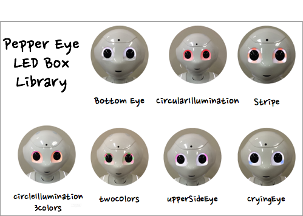
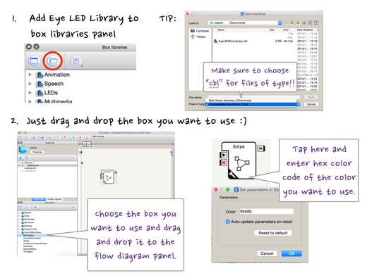

# Eye LED Box Library for Pepper

## Overview

**Eye LED Box Library for Pepper**, a library for customizing pepper's eyes.

## Demo
The library currently contains 7 eye LED boxes.

##Usage
1. Install Eye LED Library.
2. Open Chorepraphe, add Eye Box Libary to box libraries panel.
3. Drag and drop the box you want to use to flow diagram pannel.

	
	
##License

MIT License © Goldrush Computing Inc.

##Author
Goldrush Computing Inc.
