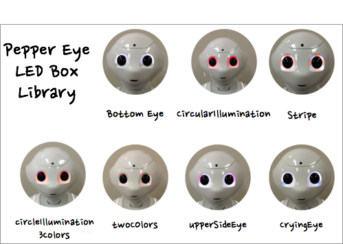

#Eye LED Box Library for Pepper

## 概要

この**Eye LED Box Library for Pepper**は、Pepperの目のLEDを様々なパターンに光らせるためのライブラリです。

## デモ
現在このボックスライブラリには7つのボックスが含まれています。

##使い方
1. ボックスライブラリをインストールします。

2. コレグラフを起動して、LEDボックスライブラリをボックスライブラリパネルに追加します。
3. 使いたいボックスをフローダイアグラムパネルにドラッグ&ドロップします。

	
	
##ライセンス
このライブラリはMIT Licenseに基づいてリリースされています。

##作者
Goldrush Computing Inc.
